# 农业系统 - 系统设计文档

## 目录
1. [系统概述](#系统概述)
2. [系统架构图](#系统架构图)
3. [数据流图](#数据流图)
4. [后端功能实现清单](#后端功能实现清单)
5. [算法实现说明](#算法实现说明)
6. [前端架构说明](#前端架构说明)
7. [数据库设计](#数据库设计)

---

## 系统概述

本系统是一个综合性的农业服务平台，支持三种角色：
- **农户（Farmer）**：农产品交易、专家咨询、融资服务
- **专家（Expert）**：问答服务、预约管理、知识发布
- **银行（Bank）**：贷款审批、智能匹配、风险监控

系统采用前后端分离架构：
- **前端**：Vue.js + Element UI + Vuex + Vue Router
- **后端**：Spring Boot + JPA + MySQL
- **通信**：RESTful API

---

## 系统架构图


### 模块划分


---

## 数据流图

### 用户登录流程


### 商品发布流程


### 贷款申请流程

```mermaid
sequenceDiagram
    participant F as 农户
    participant FE as 前端
    participant LC as LoanController
    participant LS as LoanService
    participant DB as 数据库
    
    F->>FE: 填写贷款申请
    FE->>LC: POST /api/finance/loans/apply
    LC->>LS: apply(loanDTO, operatorId)
    LS->>LS: 验证必填字段
    LS->>DB: 查询用户信息
    LS->>DB: 查询贷款产品
    LS->>LS: 创建 Loan 实体
    LS->>DB: 保存 Loan
    LS->>LS: 创建 LoanUserStatus
    LS->>DB: 保存用户状态
    LS->>LS: 创建 LoanRecord
    LS->>DB: 保存操作记录
    LS-->>LC: 返回 Loan 对象
    LC-->>FE: 返回成功响应
    FE->>FE: 显示申请成功
    FE-->>F: 跳转到申请列表
```



### 问答服务流程


### 角色权限控制流程


---

## 后端功能实现清单

### 1. 用户认证模块 (User Module)

#### AuthController (`/api/auth`)
- ? **POST /login** - 用户登录
  - 验证用户名和密码
  - 生成 Token（当前为简化版：`tk_{userId}_{username}`）
  - 返回用户信息和 Token
- ? **POST /register** - 用户注册
  - 创建新用户
  - 密码加密存储（MD5）
  - 返回用户对象

#### UserController (`/api/user`)
- ? 用户信息查询和管理
- ? 用户列表查询
- ? 用户资料更新

#### ProfileController
- ? 个人资料管理
- ? 头像上传
- ? 昵称修改

#### AssetController
- ? 用户资产信息查询
- ? 资产统计

---

### 2. 交易模块 (Trade Module)

#### ProductController (`/api/trade/products`)
- ? **GET /** - 商品列表查询
  - 支持按卖家ID查询：`?sellerId={id}`
  - 支持关键词搜索：`?keyword={keyword}`
  - 默认返回所有可用商品
- ? **POST /** - 创建商品
  - 验证商品名称、价格、卖家ID
  - 价格必须 > 0
  - 保存商品信息
- ? **GET /{id}** - 商品详情查询
  - 根据ID查询单个商品
  - 返回完整商品信息

#### DemandController (`/api/trade/demands`)
- ? 求购需求列表查询
- ? 创建求购需求
- ? 求购需求详情查询
- ? 求购需求更新和删除

#### OrderController (`/api/trade/orders`)
- ? 订单创建
- ? 订单列表查询（支持分页）
- ? 订单详情查询
- ? 订单状态更新
- ? 订单搜索（按关键词）
- ? 订单上架/下架

#### CartController (`/api/trade/cart`)
- ? 购物车商品添加
- ? 购物车列表查询
- ? 购物车商品删除
- ? 购物车商品数量更新

#### AddressController (`/api/trade/addresses`)
- ? 收货地址管理
- ? 地址添加、更新、删除
- ? 默认地址设置

---

### 3. 专家模块 (Expert Module)

#### ExpertController (`/api/expert`)
- ? 专家列表查询
- ? 专家详情查询
- ? 专家信息更新
- ? 专家搜索

#### QAController (`/api/expert/qa`)
- ? **问题管理**
  - GET /questions - 获取所有问题
  - GET /questions/recent - 获取最近10个问题
  - GET /questions/user/{userId} - 获取用户的问题
  - GET /questions/expert/{expertId} - 获取专家的问题
  - GET /questions/status/{status} - 按状态查询问题
  - GET /questions/search?keyword={keyword} - 关键词搜索
  - POST /questions - 创建问题
  - PUT /questions/{id} - 更新问题
  - DELETE /questions/{id} - 删除问题
- ? **回答管理**
  - GET /questions/{questionId}/answers - 获取问题的回答
  - GET /experts/{expertId}/answers - 获取专家的回答
  - POST /answers - 创建回答（自动更新问题状态为 ANSWERED）
  - PUT /answers/{id} - 更新回答
  - DELETE /answers/{id} - 删除回答

#### AppointmentController (`/api/expert/appointments`)
- ? 预约创建
- ? 预约列表查询
- ? 预约状态更新
- ? 预约取消
- ? 预约搜索

#### KnowledgeController (`/api/expert/knowledge`)
- ? 知识文章列表查询
- ? 知识文章详情查询
- ? 知识文章创建
- ? 知识文章更新
- ? 知识文章删除
- ? 知识文章搜索

#### ExpertDashboardController (`/api/expert/dashboard`)
- ? 专家工作台数据统计
  - 待回复问题数
  - 预约数量
  - 已发布知识数
  - 评分统计
- ? 最近问题列表
- ? 最近预约列表
- ? 通知消息

#### NewsController
- ? 农业新闻获取
- ? 新闻列表查询

---

### 4. 融资模块 (Finance Module)

#### LoanController (`/api/finance/loans`)
- ? **POST /apply** - 提交贷款申请
  - 验证必填字段（贷款金额、用户ID、操作员ID）
  - 创建 Loan 实体
  - 创建 LoanUserStatus（用户状态跟踪）
  - 创建 LoanRecord（操作记录）
  - 关联贷款产品
- ? **POST /{loanId}/upload** - 上传贷款文件
  - 支持多种文件类型
  - 文件保存到服务器
  - 关联到贷款申请
- ? **PUT /{loanId}/status** - 修改贷款状态
  - 银行端审核操作
  - 更新 Loan 状态
  - 更新 LoanUserStatus
  - 创建 LoanRecord 记录
- ? **PUT /{loanId}** - 更新贷款申请
  - 仅允许 CREATED 和 REVIEWING 状态修改
  - 更新贷款信息
- ? **POST /{loanId}/assign** - 分配处理人员
  - 将贷款申请分配给银行员工
- ? **GET /user/{userId}** - 查询用户的贷款列表
  - 通过 LoanUserStatus 关联查询
- ? **GET /{loanId}/files** - 查询贷款文件列表
- ? **GET /{loanId}/statuses** - 查询用户状态列表
- ? **GET /{loanId}/records** - 查询操作记录列表
- ? **GET /time** - 按时间段查询贷款列表

#### LoanProductController (`/api/finance/loan-products`)
- ? 贷款产品列表查询
- ? 贷款产品详情查询
- ? 贷款产品创建
- ? 贷款产品更新
- ? 贷款产品状态管理

#### MatchingController (`/api/finance/matching`)
- ? **POST /run** - 执行智能匹配
  - 当前为占位实现，返回 "matching run"
  - 待实现匹配算法

#### BankReviewController (`/api/finance/bank-review`)
- ? 银行审核相关接口
- ? 审核队列查询
- ? 审核操作

---

### 5. 银行模块 (Bank Module)

#### BankDashboardController (`/api/bank/dashboard`)
- ? 银行工作台数据统计
  - 待审核贷款数
  - 已匹配农户数
  - 风险预警数
  - 总授信额度
  - 审批通过率
  - 平均处理时间
- ? 贷款审批队列
- ? 智能匹配结果
- ? 风险预警列表
- ? 审批进度跟踪
- ? 消息通知

---

### 6. 通用功能

#### 全局异常处理
- ? `GlobalExceptionHandler` - 统一异常处理
- ? 返回标准化的错误响应

#### CORS 配置
- ? `CorsConfig` - 跨域资源共享配置
- ? 支持前端跨域请求

#### 编码配置
- ? `EncodingConfig` - UTF-8 编码配置
- ? 确保中文数据正确处理

#### API 响应封装
- ? `ApiResponse<T>` - 统一的 API 响应格式
  - `success`: 操作是否成功
  - `data`: 响应数据
  - `message`: 错误消息

---

## 算法实现说明

### 1. 用户角色解析算法

**位置**：`frontend/src/views/Login.vue` - `resolveUserRole()`

**算法逻辑**：
```javascript
resolveUserRole(res, user) {
  // 1. 从响应数据中提取角色（多种可能的字段名）
  const data = res && res.data ? res.data : {};
  const directRole = data.role || data.userRole || data.identity;
  const roles = data.roles || data.roleList;
  
  // 2. 如果直接角色不存在，尝试从角色数组中取第一个
  let role = directRole;
  if (!role && Array.isArray(roles) && roles.length > 0) {
    role = roles[0];
  }
  
  // 3. 如果仍不存在，从用户对象中提取
  if (!role && user) {
    role = user.role || user.identity || user.type;
  }
  
  // 4. 标准化角色名称（转为小写）
  if (typeof role === 'string') {
    const normalized = role.toLowerCase();
    if (['farmer', 'expert', 'bank'].includes(normalized)) {
      return normalized;
    }
  }
  
  // 5. 默认返回 'farmer'
  return 'farmer';
}
```

**特点**：
- 支持多种角色字段名（role, userRole, identity, type）
- 支持角色数组格式
- 自动标准化角色名称
- 提供默认值（farmer）

---

### 2. 路由权限控制算法

**位置**：`frontend/src/router/index.js` - `router.beforeEach()`

**算法逻辑**：
```javascript
router.beforeEach((to, from, next) => {
  const role = store.state.userRole || 'farmer';
  
  // 1. 统一首页：所有角色都访问 /home/front
  if (to.path === '/home') {
    return next('/home/front');
  }
  
  // 2. 检查路由的 meta.roles 权限
  if (to.meta && to.meta.roles) {
    if (!to.meta.roles.includes(role)) {
      // 3. 权限不足，重定向到首页
      return next('/home/front');
    }
  }
  
  // 4. 允许访问
  next();
});
```

**特点**：
- 统一首页访问
- 基于路由 meta 的权限控制
- 自动重定向未授权访问
- 默认角色为 farmer

---

### 3. 贷款申请状态管理算法

**位置**：`backend/src/main/java/com/farmporject/backend/finance/service/LoanService.java`

**状态流转**：
```
CREATED → REVIEWING → APPROVED → DISBURSED → REPAID
                ↓
            REJECTED
```

**核心逻辑**：
```java
public boolean submitByLoanId(Long loanId, Status status, Long operatorId, String remark) {
    // 1. 查询贷款申请
    Loan loan = repo.findById(loanId).orElseThrow(...);
    
    // 2. 更新贷款状态
    loan.setStatus(status);
    loan.setUpdateDate(LocalDateTime.now());
    
    // 3. 同步更新所有关联用户的 LoanUserStatus
    for (LoanUserStatus loanUserStatus : loan.getLoanUserStatuses()) {
        loanUserStatus.setStatus(status);
        loanUserStatusRepository.save(loanUserStatus);
    }
    
    // 4. 创建操作记录
    LoanRecord loanRecord = new LoanRecord();
    loanRecord.setLoan(loan);
    loanRecord.setRecordDate(LocalDateTime.now());
    loanRecord.setApplyStatus(status);
    loanRecord.setRecordDetails(remark);
    loanRecord.setUser(operator);
    loanRecordRepository.save(loanRecord);
    
    // 5. 保存并返回
    return repo.save(loan).getId() != null;
}
```

**特点**：
- 状态一致性：Loan、LoanUserStatus、LoanRecord 同步更新
- 操作可追溯：每次状态变更都记录操作人和时间
- 事务保证：使用 `@Transactional` 确保数据一致性

---

### 4. 问答状态自动更新算法

**位置**：`backend/src/main/java/com/farmporject/backend/expert/service/QAService.java`

**算法逻辑**：
```java
public Answer createAnswer(Answer answer) {
    // 1. 验证问题是否存在
    Question question = questionRepository.findById(answer.getQuestion().getId())
        .orElseThrow(() -> new RuntimeException("Question not found"));
    
    // 2. 自动更新问题状态为已回答
    question.setStatus(Question.QuestionStatus.ANSWERED);
    questionRepository.save(question);
    
    // 3. 保存回答
    return answerRepository.save(answer);
}
```

**特点**：
- 自动状态更新：创建回答时自动将问题状态改为 ANSWERED
- 数据一致性：确保问题和回答状态同步

---

### 5. 商品搜索算法

**位置**：`backend/src/main/java/com/farmporject/backend/trade/controller/ProductController.java`

**算法逻辑**：
```java
@GetMapping
public ResponseEntity<?> list(
    @RequestParam(required = false) Long sellerId,
    @RequestParam(required = false) String keyword) {
    
    List<Product> products;
    
    // 1. 优先级：按卖家ID查询 > 关键词搜索 > 全部查询
    if (sellerId != null) {
        products = productService.getProductsBySeller(sellerId);
    } else if (keyword != null && !keyword.trim().isEmpty()) {
        products = productService.searchProducts(keyword.trim());
    } else {
        products = productService.getAvailableProducts();
    }
    
    // 2. 返回结果
    return ResponseEntity.ok().body(response);
}
```

**特点**：
- 多条件查询支持
- 查询优先级明确
- 关键词自动去空格

---

### 6. 贷款申请验证算法

**位置**：`backend/src/main/java/com/farmporject/backend/finance/service/LoanService.java` - `apply()`

**验证逻辑**：
```java
public Loan apply(LoanDTO loanDTO, Long operatorId) {
    // 1. 必填字段验证
    if (loanDTO == null || 
        loanDTO.getLoanAmount() == null || 
        loanDTO.getUserIds() == null ||
        operatorId == null) {
        return null;
    }
    
    // 2. 验证操作员存在
    User operator = userRepository.findById(operatorId)
        .orElseThrow(() -> new RuntimeException("操作员不存在"));
    
    // 3. 验证所有用户存在
    List<User> users = new ArrayList<>();
    for (Long userId : loanDTO.getUserIds()) {
        User user = userRepository.findById(userId)
            .orElseThrow(() -> new RuntimeException("用户不存在"));
        users.add(user);
    }
    
    // 4. 验证贷款产品存在
    LoanProduct loanProduct = loanProductRepository.findById(loanDTO.getLoanProductId())
        .orElseThrow(() -> new ResponseStatusException(HttpStatus.NOT_FOUND, "贷款产品不存在"));
    
    // 5. 创建并保存
    // ...
}
```

**特点**：
- 多层验证：字段、用户、产品
- 异常处理：明确的错误信息
- 数据完整性：确保所有关联数据存在

---

### 7. 贷款更新权限控制算法

**位置**：`backend/src/main/java/com/farmporject/backend/finance/service/LoanService.java` - `update()`

**算法逻辑**：
```java
public boolean update(Long loanId, LoanDTO loanDto) {
    // 1. 查询贷款申请
    Loan loan = repo.findById(loanId)
        .orElseThrow(() -> new RuntimeException("贷款申请不存在"));
    
    // 2. 状态权限检查：仅允许 CREATED 和 REVIEWING 状态修改
    if (loan.getStatus() != Status.CREATED && 
        loan.getStatus() != Status.REVIEWING) {
        throw new RuntimeException("贷款申请状态不允许修改");
    }
    
    // 3. 更新字段
    loan.setLoanAmount(loanDto.getLoanAmount());
    loan.setLoanTermMonths(loanDto.getLoanTermMonths());
    loan.setLoanPurpose(loanDto.getLoanPurpose());
    loan.setRemark(loanDto.getRemark());
    loan.setUpdateDate(LocalDateTime.now());
    
    // 4. 保存
    return repo.save(loan).getId() != null;
}
```

**特点**：
- 状态机控制：仅特定状态允许修改
- 防止误操作：已审批的申请不可修改
- 时间戳更新：自动更新修改时间

---

## 前端架构说明

### 1. 路由结构

```mermaid
graph TD
    A[/] --> B[/home]
    B --> C[/home/front<br/>统一首页]
    B --> D[/home/trade<br/>农产品交易<br/>farmer]
    B --> E[/home/expertWork<br/>专家工作台<br/>expert]
    B --> F[/home/bankWork<br/>银行端<br/>bank]
    B --> G[/home/goods<br/>商品货源]
    B --> H[/home/purchase<br/>求购需求]
    B --> I[/home/orderInfo<br/>订单信息]
    B --> J[/home/guide<br/>专家指导]
    B --> K[/home/knowledge<br/>知识库]
    B --> L[/home/smartMatch<br/>智能匹配]
    B --> M[/user<br/>用户中心]
    B --> N[/addmessage<br/>发布信息]
```

### 2. 状态管理 (Vuex)

**核心状态**：
- `userRole`: 用户角色（farmer/expert/bank）
- `token`: 认证令牌
- `loginUserNickname`: 用户昵称
- `loginUserAvatar`: 用户头像
- `loginUserId`: 用户ID
- `orderId`: 当前订单ID
- `activeIndex`: 导航激活索引

**Getters**：
- `isFarmerRole`: 是否为农户
- `isExpertRole`: 是否为专家
- `isBankRole`: 是否为银行
- `currentRole`: 当前角色

### 3. API 接口层

**模块划分**：
- `user.js`: 用户相关接口
- `order.js`: 订单/商品相关接口
- `expert.js`: 专家相关接口
- `bank.js`: 银行相关接口
- `finance.js`: 融资相关接口
- `question.js`: 问答相关接口
- `knowledge.js`: 知识库相关接口
- `cart.js`: 购物车相关接口
- `address.js`: 地址相关接口

### 4. 组件结构

**通用组件**：
- `NavigationBar.vue`: 导航栏（根据角色动态显示）
- `Pagination.vue`: 分页组件
- `UserAvatar.vue`: 用户头像
- `PublishMessage.vue`: 发布信息表单

**业务组件**：
- `GoodsSource.vue`: 商品货源列表
- `ExpertSource.vue`: 专家列表
- `LoanProductList.vue`: 贷款产品列表
- `SmartMatchUser.vue`: 智能匹配用户

---

## 数据库设计

### 核心表结构


### 主要实体关系

1. **用户 (User)**
   - 一对多：商品、求购、订单、贷款、问题、回答

2. **商品 (Product)**
   - 多对一：卖家（User）
   - 一对多：订单项（OrderItem）

3. **订单 (Order)**
   - 多对一：买家（User）、卖家（User）
   - 一对多：订单项（OrderItem）

4. **贷款 (Loan)**
   - 多对一：贷款产品（LoanProduct）、操作员（User）
   - 一对多：用户状态（LoanUserStatus）、操作记录（LoanRecord）、文件（LoanFile）

5. **问题 (Question)**
   - 多对一：提问者（User）、专家（Expert）
   - 一对多：回答（Answer）

6. **专家 (Expert)**
   - 一对多：回答、预约、知识文章

---

## 技术栈总结

### 前端技术
- **框架**: Vue.js 2.x
- **UI库**: Element UI
- **状态管理**: Vuex
- **路由**: Vue Router
- **HTTP客户端**: Axios
- **构建工具**: Vue CLI

### 后端技术
- **框架**: Spring Boot
- **ORM**: Spring Data JPA
- **数据库**: MySQL 8.0+
- **构建工具**: Maven
- **Java版本**: JDK 8+

### 开发工具
- **版本控制**: Git
- **数据库管理**: MySQL Workbench / Navicat
- **API测试**: Postman

---

## 待实现功能

### 算法部分
1. **智能匹配算法** (`MatchingController`)
   - 当前为占位实现
   - 需要实现：农户需求与贷款产品的智能匹配
   - 建议算法：基于需求金额、期限、用途的相似度匹配

2. **推荐算法**
   - 商品推荐：基于用户浏览历史
   - 专家推荐：基于问题类型匹配
   - 贷款产品推荐：基于用户画像

3. **搜索算法优化**
   - 全文搜索：使用 Elasticsearch
   - 模糊匹配：改进关键词搜索
   - 排序算法：相关性排序

### 功能部分
1. **支付集成**
   - 支付宝/微信支付接口
   - 订单支付流程

2. **消息通知**
   - 站内消息系统
   - 邮件通知
   - 短信通知

3. **文件上传优化**
   - 图片压缩
   - 文件类型验证
   - 存储服务集成（OSS）

---

## 总结

本系统实现了完整的农业服务平台，包含：
- ? 三种角色的完整业务流程
- ? 前后端分离架构
- ? RESTful API 设计
- ? 角色权限控制
- ? 数据一致性保证
- ? 异常处理机制

系统具有良好的扩展性，可以在此基础上继续添加新功能和完善现有算法。

---

**文档生成时间**: 2024年
**系统版本**: v1.0
**维护者**: 开发团队


